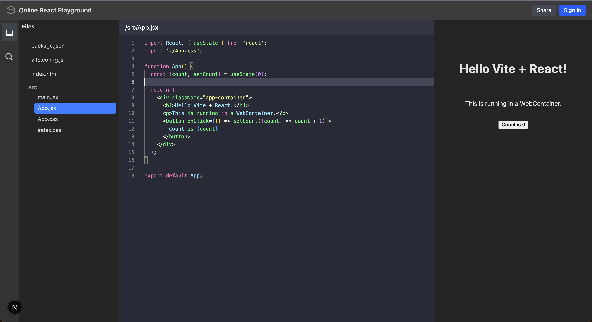

# React Playground - A VS Code-like Online Editor

  


Welcome to the React Playground, a web-based code editor that provides a development experience similar to Visual Studio Code, right in your browser. It's designed for quickly prototyping, experimenting with, and sharing React components without the need for a local development setup.

## ✨ Features

- **VS Code Inspired UI**: A familiar and intuitive interface, including an activity bar, sidebars, and a tabbed editor.
- **File Explorer**: Navigate through your project's file and folder structure with ease.
- **Live Preview**: See your changes render in real-time in a dedicated preview pane.

### Prerequisites

- Node.js (v14 or later)
- npm or yarn

### Installation

1.  **Clone the repository:**
    ```sh
    git clone [https://github.com/your-username/react-playground.git](https://github.com/your-username/react-playground.git)
    ```
2.  **Navigate to the project directory:**
    ```sh
    cd react-playground
    ```
3.  **Install dependencies:**
    ```sh
    npm install
    ```
4.  **Run the development server:**
    ```sh
    npm run dev
    # or
    yarn dev
    ```
    Open [http://localhost:3000](http://localhost:3000) to view it in your browser.

## 🛠️ Technologies Used

This project is built with a modern tech stack:

- **[React](https://reactjs.org/)**: A JavaScript library for building user interfaces.
- **[Next.js](https://nextjs.org/)**: The React framework for production.
- **[Monaco Editor](https://microsoft.github.io/monaco-editor/)**: The code editor that powers VS Code.
- **[Tailwind CSS](https://tailwindcss.com/)**: A utility-first CSS framework for rapid UI development.
- **[Fast API](https://fastapi.tiangolo.com/)**: Is a high-performance web framework for building HTTP-based service APIs in Python 3.8+.
- **[Web Container](https://webcontainers.io/)**: Is a browser-based Node js runtime environment

## 🔮 Future Improvements

We have plans to add more features to make this playground even more powerful:

- [ ] Continue adding Integration with a real WebContainer API for in-browser code execution.
- [ ] Resizable panes for a more flexible layout.
- [ ] Support for adding and removing files/folders.
- [ ] Terminal integration.
- [ ] More themes for the editor.
- [ ] Auth, google auth, etc.
- [ ] project base questions, feature implementatins, fixing bug in provided code.
